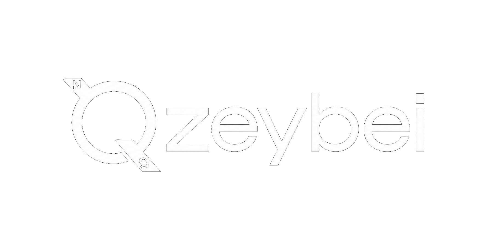

<h1 align="center">
    
</h1>

<h3 align="center">A developer from Turkey who never stops learning!</h3>

 

 
 🔭 I’m currently working with **Python**
 
 🌱 I’m currently learning **React, Django**

💬 Ask me about anything **[here](https://github.com/KuzeyGorgulu/KuzeyGorgulu/issues)**

   
 
    
  

  
  

  
  <h2 align="center">⚒️ Languages-Frameworks-Tools ⚒️</h2>
   
  

      
       

 

  <h2>🐍 My Contributions 🐍</h2>
   
  
  
     

 
 

   
  
   

<!---
NorthString/NorthString is a ✨ special ✨ repository because its `README.md` (this file) appears on your GitHub profile.
You can click the Preview link to take a look at your changes.
--->
